# 🌍 Wanderlust - Explore, Share & Book Your Next Adventure


Wanderlust is a **full-stack travel platform** designed to help users **explore, share, and book** destinations worldwide. Built using the **MEN stack (MongoDB, Express.js, Node.js)**, Wanderlust offers an immersive experience for adventurers looking to discover new places and make bookings seamlessly.

---

## ✨ Features

### ✅ Core Features
- 🔑 **User Authentication**: Secure login and registration using **Passport.js**.
- 🏥 **Listings Management**: Users can **create, edit, and delete** travel listings.
- ⭐ **Reviews & Ratings**: Leave **detailed reviews and ratings** for various locations.
- ☁️ **Cloud Storage**: **Image uploads** are handled via **Cloudinary**.
- 🗺 **Map Integration**: Interactive maps powered by **Mapbox API**.
- 📱 **Responsive UI**: Built with **EJS & Bootstrap** for a smooth experience.
- 🏨 **Booking System**: Users can **book stays** at listed locations.
- 💳 **Secure Payments**: Integrated **Razorpay** for **hassle-free transactions**.
- ⏳ **Real-Time Availability**: Users **cannot book** dates that are already reserved.
- ❌ **Past Date Restriction**: Users **cannot** book for past dates.
- 📺 **Mailer Service**: Integrated **Brevo** for sending emails, including booking confirmations and user notifications.
- 💾 **Data Storage**: All data is securely stored using **MongoDB Atlas** for scalable and managed cloud databases.
- 📊 **Admin Dashboard**: Advanced **analytics and management** for listings & bookings.

---

## 🖼 Screenshots

### 🏠 Home Page
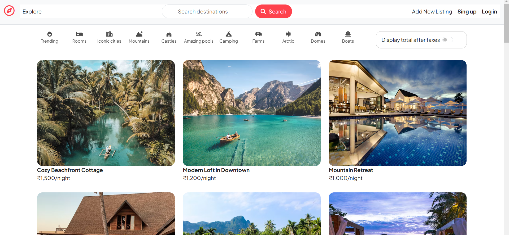

### 🔐 Authentication Pages
#### Login Page
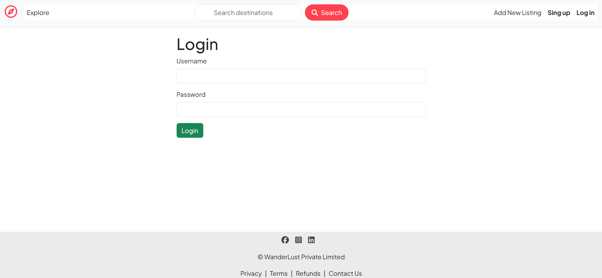

#### Signup Page
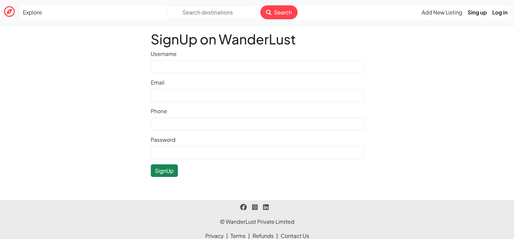

### 👤 User Profile
#### Profile Overview
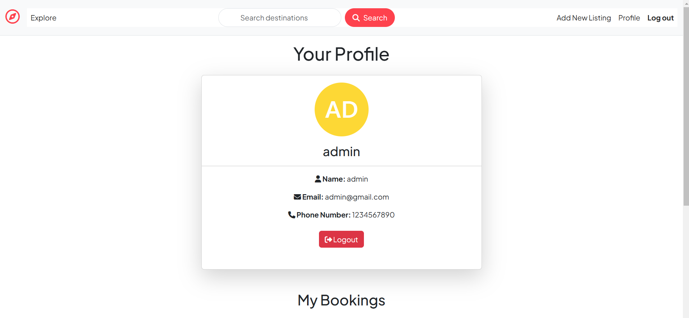
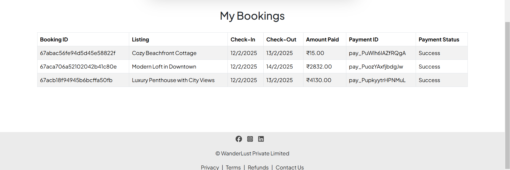

### 📍 Listing Views
#### Listing Overview
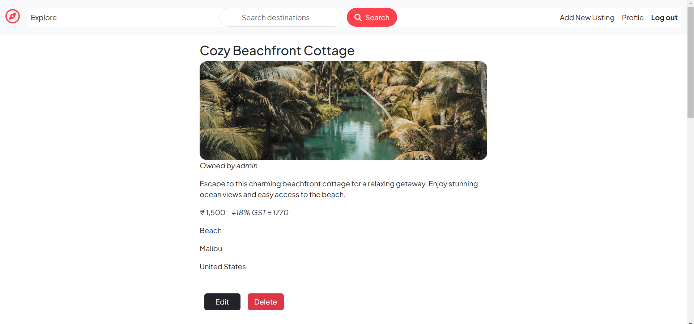

#### Reviews Section
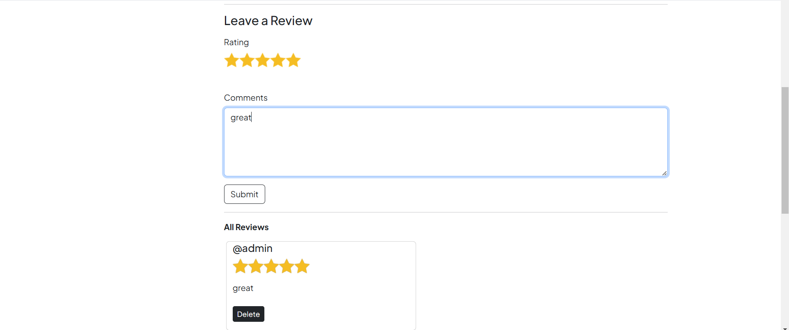

#### Map Integration
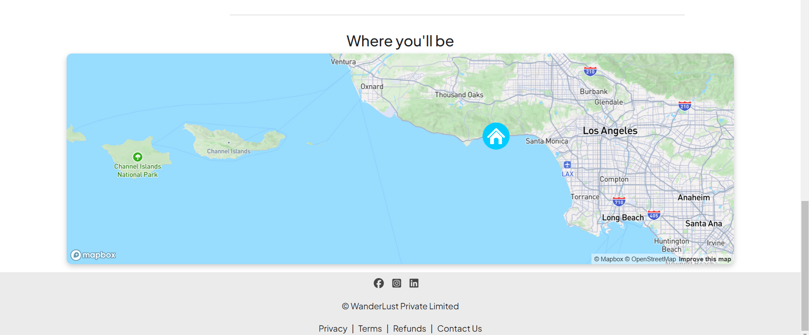

### 🏥 Creating & Editing Listings
#### Create a New Listing
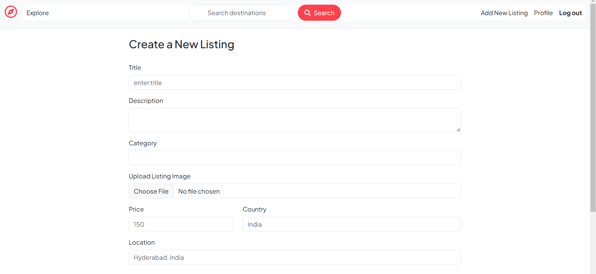

#### Edit a Listing
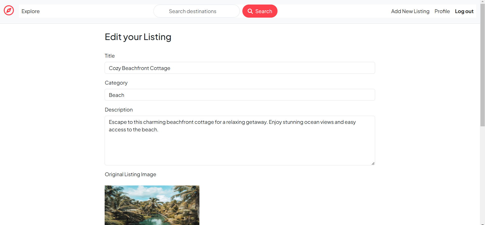

### 🏨 Booking & Payment
#### Booking Page
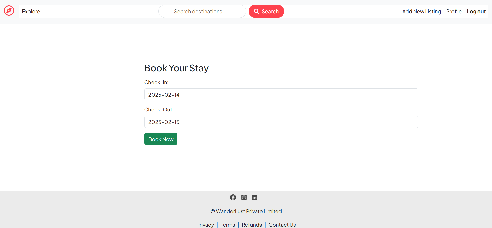

#### Booking Confirmation
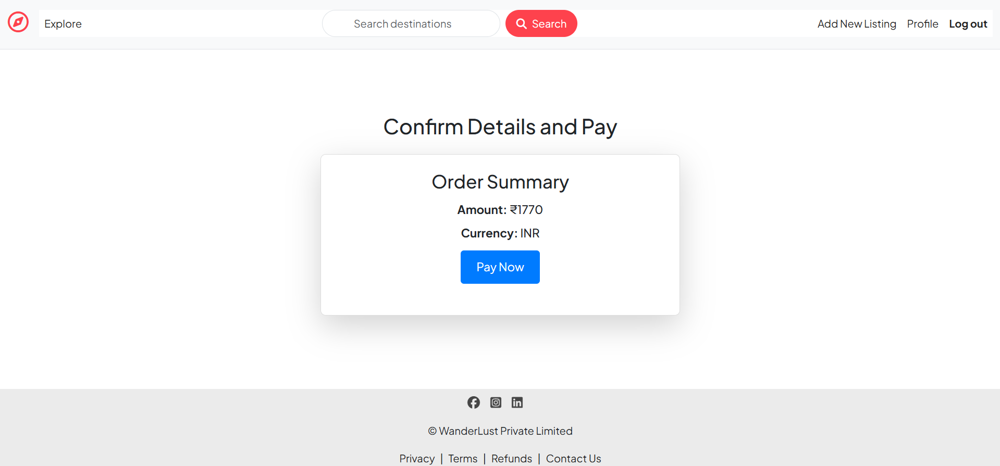

#### 💳 Razorpay Payment Gateway  
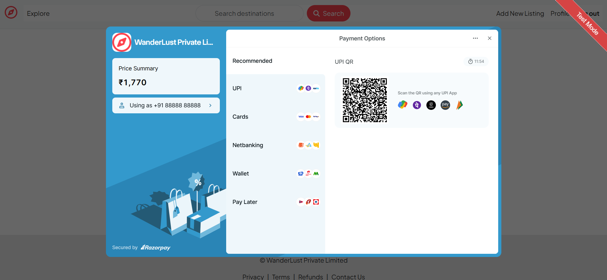  

#### 📊 Admin Dashboard  
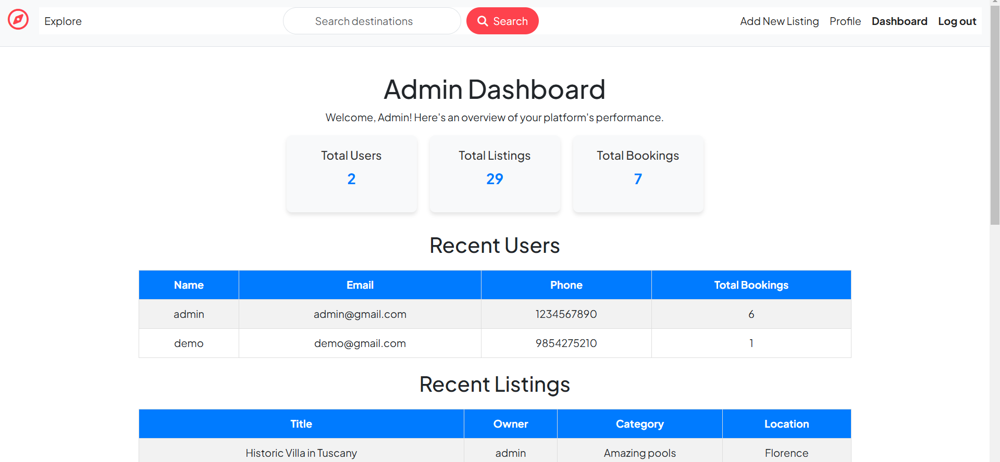  

#### 📩 Contact Us - Brevo (Mailer)  
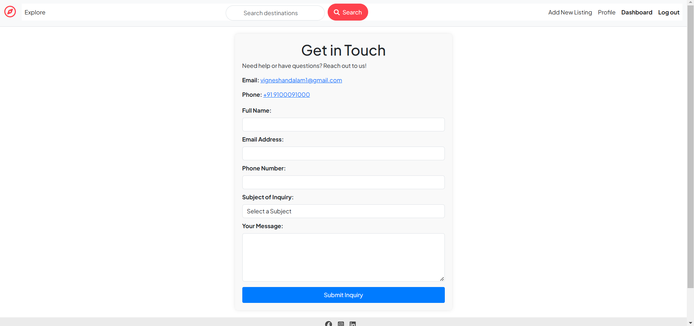  

---

## 🛠 Tech Stack

| Technology   | Usage        |
|-------------|-------------|
| **Backend** | Node.js, Express.js, MongoDB |
| **Frontend** | EJS, Bootstrap |
| **Authentication** | Passport.js |
| **File Storage** | Cloudinary |
| **Mapping Service** | Mapbox API |
| **Payment Gateway** | Razorpay |
| **Mailer Service** | Brevo |

---

## 🏷️ Installation

To run the project locally, follow these steps:

```sh
# Clone the repository
git clone https://github.com/vigneshandalam4/delta-project.git

# Navigate into the project directory
cd delta-project

# Install dependencies
npm install

# Create a .env file and configure required environment variables

# Start the server
node index.js
```

---

## ⚙️ Environment Variables

Create a `.env` file in the root directory and add the following variables:

```env
CLOUD_NAME=<your_cloudinary_cloud_name>
CLOUD_API_KEY=<your_cloudinary_api_key>
CLOUD_API_SECRET=<your_cloudinary_api_secret>
MAP_TOKEN=<your_mapbox_access_token>
ATLASDB_URL=<your_MongoAtlas_DB_connection_string>
SECRET=<anything>
RAZORPAY_KEY_ID=<your_Razorpay_public_key>
RAZORPAY_KEY_SECRET=<your_Razorpay_secret_key>
BREVO_API_KEY=<your_Brevo_api_key>
```

---

## 🎯 Usage

1⃣ **Sign up** or **log in** to your account.
2⃣ **Browse listings** of various travel destinations.
3⃣ **Add new listings** with images, descriptions, and locations.
4⃣ **Book stays** at your favorite destinations and **make secure payments via Razorpay**.
5⃣ **View past bookings** from your profile.
6⃣ **Leave reviews** and ratings for destinations.
7⃣ **Receive email notifications** for bookings and other updates via **Brevo**.

---

## 🐟 License

This project is licensed under the **MIT License**.

---

## 📩 Contact

For any inquiries, feel free to reach out via **GitHub** or email.

---

⚠️ **Note:** This repository contains only the README file. The actual project is private. If you need access, please contact me.
